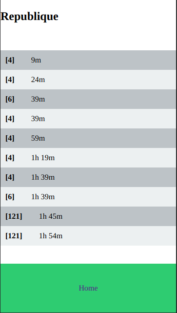

# bus-rennes
Prochain bus à Rennes à votre arrêt 

Simple application pour être informé du temps de passage des bus à Rennes. 

## Accéder
`serverURL/schedule?line=${LINE}&stop=${STOP}`

## Paramètres

### LINE  
Une liste séparée par des virgules. Cette liste contient le nom court de la ligne (ex: C4) suivi du sens: 0 ou 1. A tester ici: https://data.explore.star.fr/explore/dataset/tco-bus-circulation-passages-tr/api/

exemple: line=C4,0,C6,0

### STOP
Le nom de l'arrêt:

(l'URL doit bien sûr être encodée)
exemple stop=Republique
